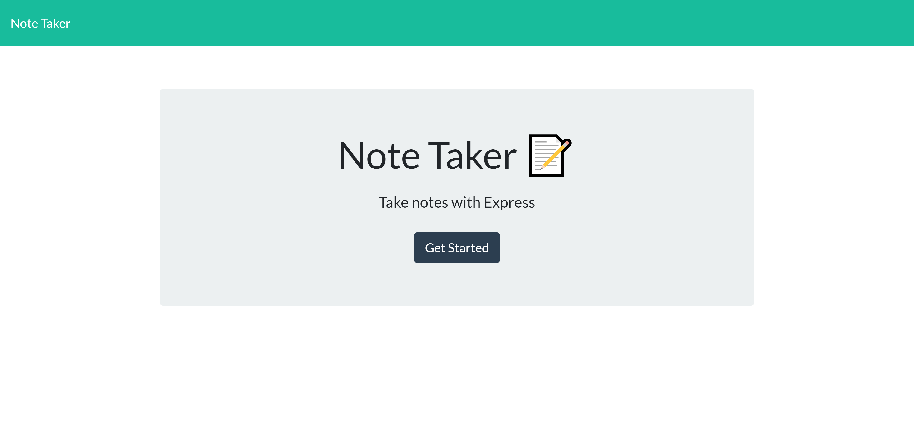
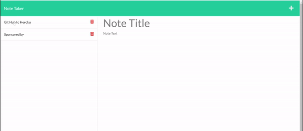

# [Express.js: Note Taker](https://note-taker-git.herokuapp.com/)

This is a web application that can be used to write and save notes. Give give it a title, and then click on the icon on the upper right corner of the webpage.

## Table of Contents

- [Technologies](#technologies)
- [Code Snippets](#code-snippets)
- [Software Demo](#demo)
- [Credits](#credits)
  

## Technologies Used
- HTML
- CSS
- Bootstrap
- Javascript
- Node.js
- jQuery
- Express.js
- Heroku

The application utilizes Express.js for its back end, while the notes are stored and will be retrieved from JSON file.

## Code Snippets
The following snippet showcases how the application saves and retrieves the notes entered by the user. 
```java
app.post('/api/notes', (req, res) => {
    console.info(`${req.method} request received to add a note`);
    const { id, title, text } = req.body;
    if (title && text) {
        // Variable for the note we're saving
        const newNote = {
            id,
            title,
            text,
        };
        // Obtain existing notes
        fs.readFile('./db/db.json', 'utf8', (err, data) => {
          if (err) {
            console.error(err);
          } else {
            // Convert string into JSON object
            const parsedNotes = JSON.parse(data);
    
            // Add a new note
            parsedNotes.push(newNote);
            notes = parsedNotes;
            fs.writeFile(
              './db/db.json',
              JSON.stringify(parsedNotes, null, 4),
              (writeErr) =>
                writeErr
                  ? console.error(writeErr)
                  : console.info('Successfully updated notes!')
            );
          }
        });
        const response = {
          status: 'success',
          body: newNote,
        };
        console.log(response);
        res.json(response);
      } else {
        res.json('Error in posting note');
      }
});
```

## Demo

<br>

<br>

## Credits

UCB - Coding Bootcamp

---

© 2022 Clement Koo. All Rights Reserved.
[LinkdIn](https://www.linkedin.com/in/clement-t-k-459322138/) |
[GitHub](https://github.com/C-K999)
